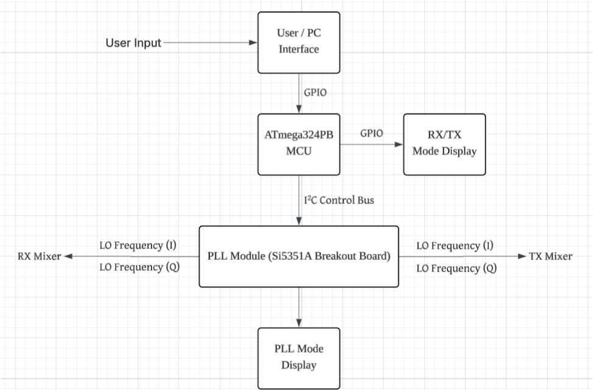
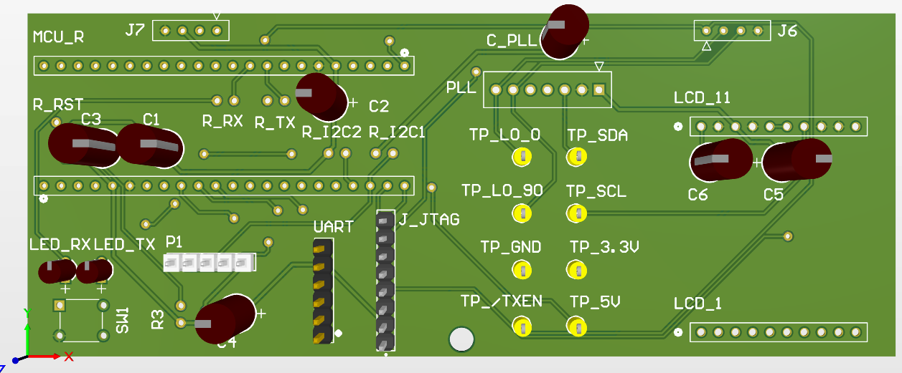
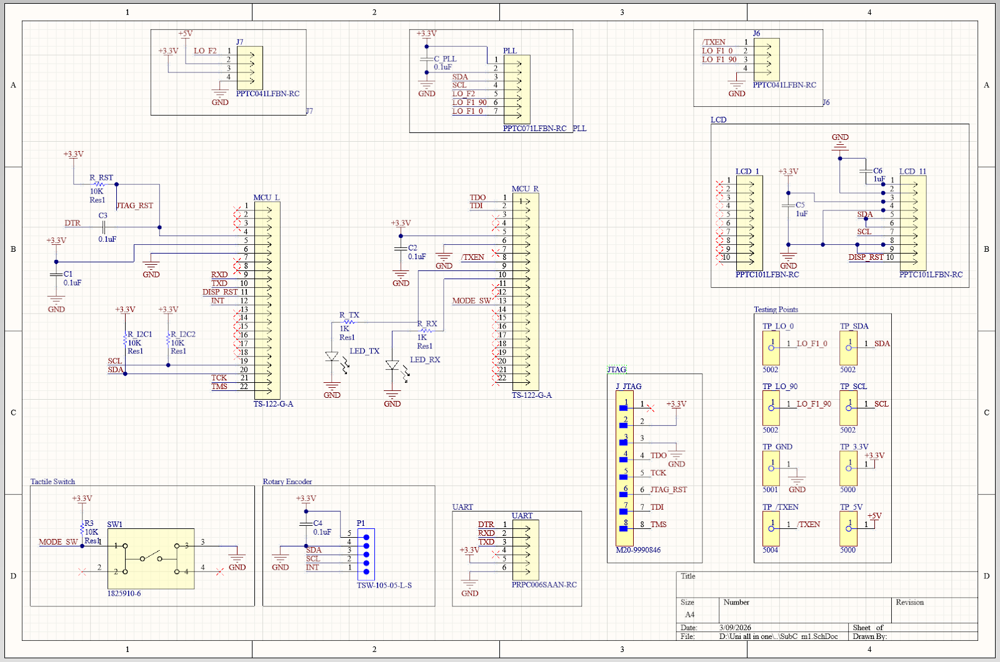
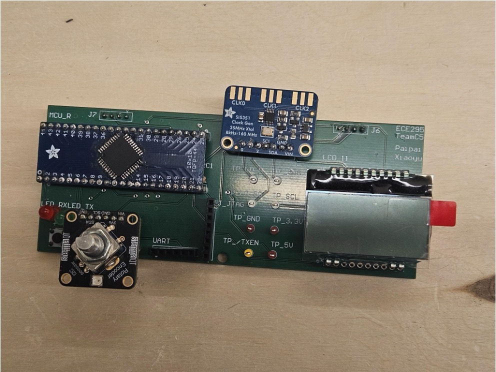
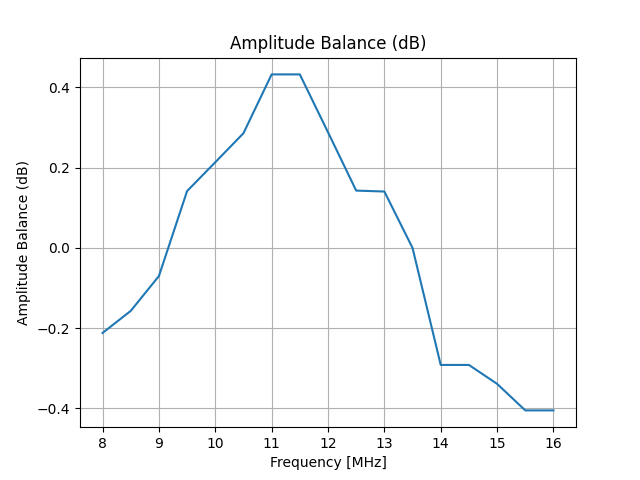
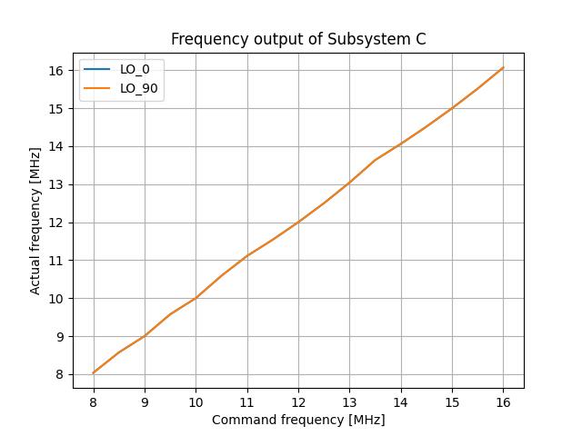
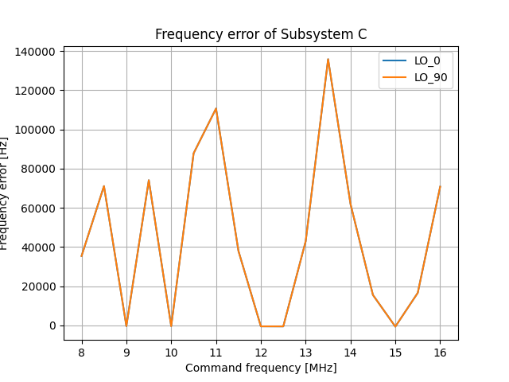
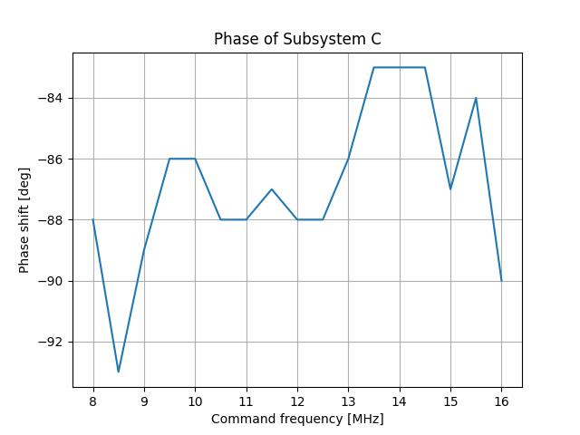
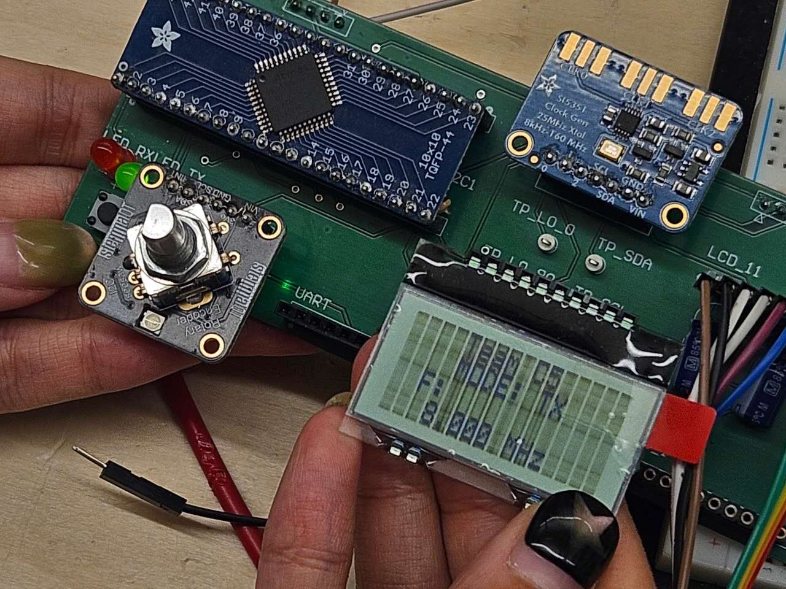
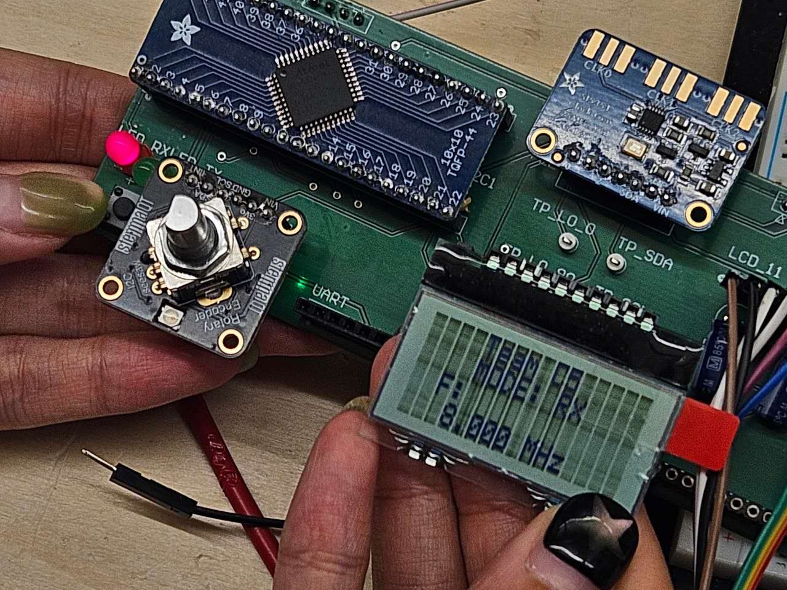

# Embedded SDR Controller

> Embedded control subsystem for a software-defined radio (SDR) transceiver, featuring a custom PCB, ATmega324PB firmware, and real-time frequency control.

> **Hardware Design Course Project**

> **Note:** Source code is not included due to University of Toronto academic integrity policies.

---

## Overview

Our team designed and built the control subsystem for a software-defined radio (SDR) transceiver. The controller allows users to adjust the output frequency in real time using a rotary encoder while displaying system information on an LCD. It communicates with a Si5351 frequency synthesizer over I²C and provides control signals to downstream RF subsystems.

The project involved the complete embedded hardware development workflow, including schematic design, PCB layout, firmware development, PCB assembly, and hardware validation.

---

## Project Objectives

- Design a custom PCB for the SDR control subsystem
- Develop embedded firmware for the ATmega324PB microcontroller
- Configure the Si5351 frequency synthesizer via I²C
- Display system status on a 1602 LCD
- Enable real-time frequency adjustment from 8 MHz to 16 MHz
- Produce a manufacturable hardware design

---

## System Architecture

---

## My Contributions

### PCB Design

- Designed the complete schematic and two-layer PCB using **Altium Designer**
- Performed ERC and DRC verification
- Generated manufacturing-ready Gerber files
- Assembled and soldered the PCB

### Embedded Firmware

- Developed polling-based firmware in Embedded C
- Configured the Si5351 frequency synthesizer over I²C
- Controlled the 1602 LCD display
- Implemented rotary encoder input for real-time frequency adjustment

### Team Leadership

- Led a two-person subsystem team
- Coordinated hardware and firmware integration within the transceiver project

---

## Hardware

### PCB

### Schematic

### Assembled Board

---

## Firmware

The firmware initializes all peripherals before entering a polling loop that continuously:

1. Reads the rotary encoder
2. Calculates the target frequency
3. Updates the Si5351 through I²C
4. Refreshes the LCD display

---

## Technical Challenges

### Hardware Integration

The project required integrating multiple peripherals, including the Si5351 frequency synthesizer, LCD, and rotary encoder, into a single embedded controller while maintaining reliable communication over I²C.

### PCB Design

Creating a manufacturable PCB required schematic verification, layout validation, and fabrication-ready design rule checks before assembly.

### Embedded Control

The firmware was designed to provide responsive user interaction while maintaining stable communication with all peripherals.

---

## Testing Result

**Amplitude_balance**
- Results: The amplitude balance is within -0.41 dB to +0.43 dB, which is well inside the ≤ 1 dB requirement.

**Frequency output**
- Results: Both LO outputs track the command frequency across the full range. No missing or stuck frequencies. 

**Frequency error**
- Results: Only 5 out of 17 frequency points meet the "less than 1000 Hz" error requirement. The error is as high as 135 kHz at 13.5 MHz.
- Cause analysis:
    1. PLL not responding to I2C commands - CAT response returns old frequency, which suggests write failed.
    2. Incorrect PLL register values - Some multipliers produce correct lock, others do not.
    3. Loop filter unstable - Some frequencies fall outside PLL capture range.
    4. Microcontroller UART/CAT parsing bug - Not all commands are parsed correctly.

**Phase shift**
- Results: The phase difference ranges from -83° to -94°, which is well within the ±12.5° tolerance.

---

## Demo

Transit Mode

Receive Mode

---

## Lessons Learned

This project strengthened my understanding of the complete embedded hardware development process, from schematic capture and PCB layout to firmware implementation and hardware bring-up.

It also reinforced the importance of designing hardware and firmware together as an integrated embedded system.

---

